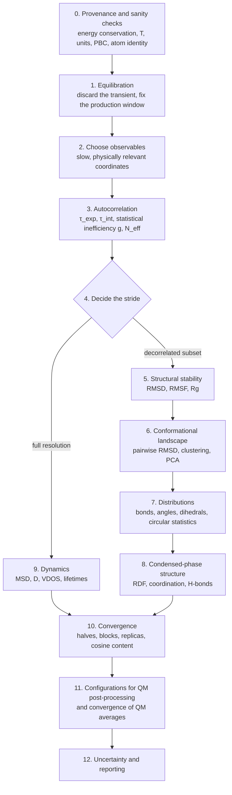

# Analysing ab initio and classical MD trajectories: a recommended workflow

*A living document of MONET.*

| | |
| --- | --- |
| Version | 0.2, 2026-09-21 |
| Scope | Analysis of equilibrium ab initio (AIMD: BOMD, CPMD, FPMD) and classical MD trajectories. The end goal is statistically sound averages and statistically independent configurations for QM post-processing. |
| Status | Draft for discussion. Sections marked **[open]** need input, examples or a decision. |
| Maintainer | T. Francese |

This document states the order in which a trajectory should be analysed, why that order is right, and the literature behind each step. Where MONET implements a step, it names the function and the tab. Where MONET does not yet implement a step, it says so, so the document also serves as a roadmap.

**How to contribute.** Every recommendation must cite at least one reference from §14. Plain rules of thumb must be labelled *rule of thumb*. To change the document:

- add or change a section;
- add the reference, with a DOI checked on doi.org or Crossref;
- log the change in §16.

Recommendations that the literature disputes are marked **[debated]**, and the competing positions are given.

---

## 0. The workflow at a glance

Textbook background for everything below: [1–4]. Three principles run through the whole workflow:

1. **Stationarity comes before statistics.** Autocorrelation functions, block averages and error bars assume a stationary time series. Estimate them only on the production window (§2).
2. **Different analyses need different frame sets.**
   - Static, ensemble averages need *independent* samples. Use the decorrelated subset, or all frames with a correlation-corrected error.
   - Dynamical quantities need *consecutive* frames at the original resolution. Never compute an MSD, VDOS or lifetime on a subsampled trajectory. See the table in §4.
3. **No analysis can detect states that were never visited** [5, 6]. An ACF that decays, a flat RMSD and small error bars show that the run is self-consistent. They do not show that it is converged. The limits of what a trajectory can show must be stated (§10).

---

## 1. Provenance and sanity checks (step 0)

Check these before any structural analysis:

| Check | Why | Classical MD | AIMD |
| --- | --- | --- | --- |
| Conserved quantity (total energy in NVE; extended energy with a thermostat) | Drift means the time step is too large, SCF convergence is poor, or the integrator has a bug. [7] | ✓ | ✓ essential: SCF tolerance and time step control the drift |
| Temperature and its distribution | Check that the ensemble is the intended one. The kinetic-energy distribution must match the canonical one. [8, 9] | ✓ | ✓ with few atoms the fluctuations of T are large, which is expected |
| CPMD adiabaticity: fictitious electronic kinetic energy stays small and does not drift | Energy leaking from the ions to the electrons biases forces and dynamics. [10] | – | ✓ (CPMD) |
| Thermostat type and coupling | Strong stochastic thermostats (Langevin, Andersen) distort transport and kinetics. [11, 12] | ✓ | ✓ |
| Units (time step in fs vs a.u., saved-frame interval) | Every τ, D and frequency depends on them. | ✓ | ✓ 1 a.u. of time = 0.02419 fs |
| Cell and PBC: lattice vectors and their orientation; NVT or NPT | Minimum-image distances, unwrapping and RDF normalisation need the true simulation cell. | ✓ | ✓ |
| Atom identity: same order, elements and count across files and tools | A silent reordering corrupts RMSD and internal coordinates. | ✓ | ✓ |

**MONET.**
- *MDAnalysis › Topology & consistency* compares the atom list between MONET, ASE and MDAnalysis.
- *Time axis* requires an explicit time step and unit: nothing is assumed.
- The *Crystal cell* panel handles cells.
- **[gap]** MONET does not yet read energies, temperatures or the CP fictitious kinetic energy. A *Sanity* tab that plots columns from the engine's energy output would close this gap: CPMD `ENERGIES`, Qbox `<etotal>`, CP2K `.ener`, GROMACS `.edr` via `panedr`.

---

## 2. Equilibration: fixing the production window (step 1)

The first part of every trajectory relaxes from the starting structure. For AIMD this is usually a classical or optimised geometry, often with a different force field or functional. Including that part biases every average.

**Recommended procedure**

1. Plot the slow observables against time: potential energy, density or volume in NPT, the RMSD from the starting structure, and the key torsions.
2. Choose the start of production t₀ with an objective criterion:
   - **Maximum effective sample size** [13]: choose the t₀ that maximises N_eff(t₀) = (T − t₀)/g(t₀), where g is the statistical inefficiency of the data after t₀ (§4.1). This balances bias against variance automatically.
   - **Reverse cumulative averaging** [14]: average backwards from the end of the run and find where the earlier data stop being consistent with the later data.
3. Confirm with the trend test (§10): the mean of the first and second halves of the production window must agree within their errors.

*Rule of thumb for AIMD:* production runs are often only 10–100 ps long, so a few ps of equilibration is a large share of the data. Say explicitly how much was discarded and why. Grossman et al. [15] showed that properties of AIMD water depend on the simulation protocol (length, equilibration, fictitious mass). Short runs need extra care.

**MONET.**
- *MONET Custom Functionalities › Fluctuations & trends* reports, for each series, the linear trend, the drift between the two halves and a block-based significance test (`series_statistics` in `monet_analysis.py`).
- *Autocorrelation › **Detect equilibration*** implements Chodera's maximum-N_eff method [13]: `detect_equilibration` in `monet_analysis.py` scans t₀ over the first half of the run and returns the t₀ that maximises N_eff(t₀) = (T − t₀)/g(t₀). **✂ Use the production window from t₀** then crops the active trajectory to it, exactly like the uncorrelated trajectory does, with **↩ Full trajectory** to go back.

---

## 3. Choosing observables (step 2)

The decorrelation time depends on the observable. A bond length decorrelates in tens of fs, a torsion in hundreds of fs to ns, and a ring pucker or a solvent-shell rearrangement even more slowly. The stride must be set by the **slowest observable that matters for the property you will compute** [5, 6].

- For QM post-processing of a chromophore (excitation energies, ΔE_ST, couplings), the relevant coordinates are those that modulate the electronic structure. Typical examples are donor–acceptor torsions and bond-length alternation. In the reference TADF study [16], the donor–acceptor dihedral was the slow, electronically relevant coordinate.
- Always include one **global** coordinate as a safety net: the RMSD from the average structure, or a principal-component projection (§6). It catches slow motions that you did not anticipate.
- Compute torsions with circular statistics (§7), or unwrap them. A torsion that jumps across 0/360° gives a spurious fast decorrelation.

**[open]** Build a table of typical τ values by coordinate type and system class (small organic molecule in vacuum or solvent, liquid water, ionic liquid, protein side chain), each with its reference.

---

## 4. Autocorrelation, statistical inefficiency and the stride (steps 3–4)

### 4.1 Definitions

For a stationary series x(t) with mean ⟨x⟩ and variance σ², the normalised fluctuation autocorrelation function (ACF) is

$$C(t) = \frac{\langle \delta x(0)\,\delta x(t)\rangle}{\langle \delta x^2\rangle}, \quad \delta x = x - \langle x\rangle$$

Two different correlation times follow from it and should not be confused [17, 18]:

- **Exponential time τ_exp**: the slowest decay, C(t) ~ e^{−t/τ_exp} at long t. It controls how long the system takes to forget its initial state, which matters for equilibration and for the spacing between samples.
- **Integrated time τ_int** = ∫₀^∞ C(t) dt. It controls the **error of the mean**. For N frames saved Δt apart, the *statistical inefficiency* is

$$g = 1 + 2\sum_{k\ge1} C(k\,\Delta t) \approx \frac{2\,\tau_{\mathrm{int}}}{\Delta t}$$

$$N_{\mathrm{eff}} = \frac{N}{g}, \quad \mathrm{SEM} = \frac{\sigma}{\sqrt{N_{\mathrm{eff}}}}$$

[5, 6, 19, 20]. For a pure exponential, τ_int = τ_exp. The two differ whenever the decay has more than one time scale.

### 4.2 Estimating C(t) in practice

- **Estimator.** Use the FFT with zero padding, averaged over all time origins; this is O(N log N). Normalise each lag by the number of pairs (N − m). At lags beyond about N/2, few time origins contribute and the tail is noise, so only show or fit C(t) up to about N/2.
- **Truncating the sum for τ_int.** The noisy tail makes the plain sum diverge. Common choices:
  - the first zero crossing [19]: simple, but biased low when noise crosses zero early;
  - Sokal's self-consistent window, which sums up to M ≥ c·τ_int(M) with c ≈ 5–6 [17, 21];
  - Geyer's initial positive or monotone sequence [22];
  - Wolff's automatic windowing (Γ-method), which also gives the error of τ_int [18].
- **Fit model.** exp(−t/τ) is the simplest model. It is also the one used in the reference workflow [16].
  - If C(t) is clearly bi- or multi-exponential (a fast librational decay followed by slow conformational decay), fit a sum of exponentials. Alternatively, fit a stretched exponential, exp[−(t/τ)^β], β ≤ 1 [23], and report ⟨τ⟩ = (τ/β)Γ(1/β).
  - The slow component sets the stride.
- **A plateau above zero** means that some process has not decorrelated within the run. Typical causes are a trend, or rare jumps between conformers. Do not hide it by fitting an offset. Instead:
  1. go back to §2, to check for drift;
  2. go to §6, to count conformers and transitions;
  3. accept that the run is too short for that observable.
- **Length of the run.** Sokal recommends a run of the order of 1000 τ for a reliable estimate of τ itself [17]. AIMD runs are almost never this long, so report τ with its uncertainty and treat the stride as approximate. [rule of thumb] A run shorter than about 20–50 τ gives an unreliable τ and an unreliable error bar.
- **Circular observables.** For dihedrals, use the ACF of the unit vector e^{iθ} with its mean removed (§7). The alternative ⟨cos[θ(t) − θ(0)]⟩ decays to R², not to 0, for a confined torsion.

**Cross-check with block averaging** [20]. Split the series into blocks of length b and compute the standard error of the block means as a function of b. The SEM grows with b and reaches a plateau once b ≫ τ_int. The plateau value is the true SEM, and g = b·σ²_block/σ². Block averaging does not need the ACF, so it is an independent check. If there is no plateau, the run is too short.

### 4.3 How far apart should samples be? [debated]

If C(t) = e^{−t/τ}, samples taken every s = kτ form an AR(1) process with lag-1 correlation ρ = e^{−k}. Their statistical inefficiency is g = (1 + ρ)/(1 − ρ). A run of length T contains at most N_eff = T/(2τ) independent samples, however densely it is sampled.

| Stride s | Residual correlation ρ between consecutive samples | g of the subsampled series | QM calculations per independent sample | Share of the run's information kept, N_eff / (T/2τ) |
| --- | --- | --- | --- | --- |
| 0.5 τ | 0.61 | 4.08 | 4.1 | 98 % |
| 1 τ | 0.37 | 2.16 | 2.2 | 92 % |
| 2 τ | 0.14 | 1.31 | 1.3 | 76 % |
| 3 τ (ε = 5 %) | 0.050 | 1.10 | 1.1 | 60 % |
| 4.6 τ (ε = 1 %) | 0.010 | 1.02 | 1.0 | 43 % |

How to read the table:

- **Stride ≈ τ to 2τ**, as in Chodera's subsampling with stride g [19] and in the reference workflow [16], keeps almost all the information in the run. Consecutive samples are still partly correlated, so error bars on QM averages must use g of the *sampled* series. Do not assume g = 1.
- **Stride ≈ 3τ to 5τ**, which is MONET's plateau criterion t* = τ ln(1/ε), gives nearly independent samples. Plain statistics such as the SEM, histogram errors and KS tests are then valid as they stand. The price is a smaller sample for the same run.
- When each QM calculation is **expensive** (TDDFT, GW, multireference), 2τ to 3τ is a reasonable compromise. When calculations are cheap, sample densely (≤ τ) and correct the errors with g.

The table assumes a single-exponential ACF. For multi-exponential decays, apply it to the slowest relevant τ.

### 4.4 Which frames go into which analysis

| Analysis | Frames | Reason |
| --- | --- | --- |
| ACF, block averaging, equilibration | full production window | They measure the correlation themselves |
| MSD, diffusion, VDOS, H-bond and residence lifetimes, any time-correlation function | **full resolution**, never subsampled | They need consecutive frames. Subsampling aliases high frequencies (VDOS) and removes short-time information. |
| Averages and distributions of static properties (RMSD, bonds, angles, dihedrals, RDF) | all frames with a g-corrected error, **or** the decorrelated subset | Both are valid. The subset makes the histogram errors and the tests honest. |
| Pairwise RMSD matrix, clustering | decorrelated subset | This limits redundant, correlated neighbours along the diagonal. It is also cheaper: the cost grows as N². |
| QM post-processing | decorrelated subset (§11) | Each QM calculation must add new information. |

**MONET.** The ACF is the first analysis tab of *MONET Custom Functionalities*.
- `autocorrelation` computes the linear or circular normalised ACF with the FFT and averages over groups.
- `correlation_time` fits exp(−t/τ) or (1 − c)e^{−t/τ} + c, up to the first zero crossing, three 1/e times, or all lags. It also returns τ_int with the chosen estimator (below; Sokal's window by default, not the fit's first-zero-crossing truncation).
- MONET then computes t* = τ ln(1/ε) and the stride ⌈t*/Δt⌉. It writes the uncorrelated extXYZ with `source_frame` tags and can make it the active trajectory.
- The SEM in the plot notes uses N_eff = N/(2τ_int), with τ_int from the same Sokal window as the ACF panel.
- **τ_int estimator.** `integrated_time` in `monet_analysis.py` implements Sokal's self-consistent window (default, M ≥ 5 τ_int(M)) [17, 21], Geyer's initial monotone sequence [22], and the first-zero-crossing rule kept for MONET ≤ 2.1 [19]. The Autocorrelation tab exposes the choice, and shows τ_int with its error τ_int·√(2(2M+1)/N) (Madras & Sokal 1988 [21]; Wolff's Γ-method [18]) and the window M.
- **Block averaging.** `block_average` implements Flyvbjerg–Petersen blocking [20]: the SEM of the block means against block size, its own error, and the plateau (`plateau_index`, `plateau_sem`, `g`). The ACF panel plots it under the ACF as an independent cross-check of the ACF-based SEM.
- **g of the sampled series and T/τ.** The ACF panel reports g = 1 + 2 Σ C(j·stride) and N_eff = kept/g for the configurations at the chosen stride, and the run length T in units of τ, with a warning below 20 τ and a note below 50 τ [17].

**[gap]**
- Multi-exponential and stretched-exponential fit models.

---

## 5. Structural stability: RMSD, RMSF, Rg (step 5)

**RMSD against a reference** after optimal superposition, computed with the Kabsch algorithm [24, 25] or quaternions [26, 27]:

- **Reference.** The choice changes the meaning of the plot:
  - the *first* frame measures drift from the start;
  - an *optimised or crystal* structure measures deviation from a model;
  - the *average* structure measures fluctuation. It must be computed iteratively, because the average depends on the alignment.
- **Atom subset.** For organic molecules, use the heavy atoms. Hydrogens add fast, uninformative noise. Symmetry-equivalent atoms (methyl H, the two O of a carboxylate, ring flips) inflate the RMSD because swapping them looks like a large displacement. Exclude them, or use a symmetry-aware RMSD.
- **PBC.** Unwrap first, so that molecules split by the cell boundary are whole.
- **Interpretation.**
  - RMSD is a degenerate measure: very different structures can have the same RMSD from the reference.
  - A flat RMSD is necessary but not sufficient for equilibration. Knapp et al. [28] found that experts' judgements of convergence from RMSD plots were inconsistent.
  - Different properties converge on different time scales [29].
  - Use the RMSD only together with §6 and §10.

**RMSF** is the per-atom fluctuation around the average structure after alignment. It relates to crystallographic B-factors through B = (8π²/3)⟨Δr²⟩. It shows which parts of the molecule are flexible. **Radius of gyration** tracks the overall compactness.

**MONET.**
- `kabsch_rmsd` handles the choice of reference frame and optional unwrapping.
- `atomic_fluctuations` computes the RMSF after iterative Kabsch alignment to the average.
- MDAnalysis provides `rms.RMSD`, `rms.RMSF` and the radius of gyration.

**[gap]** Symmetry-aware RMSD, i.e. a minimum over permutations of equivalent atoms, for example with the Hungarian algorithm per element or with graph automorphisms.

---

## 6. Conformational landscape: pairwise RMSD, clustering, PCA (step 6)

**Pairwise (2D) RMSD matrix.** Compute RMSD_ij for every pair of frames, after superposition, on the decorrelated subset.
- Square blocks along the diagonal are metastable basins.
- Off-diagonal low-RMSD regions show that the trajectory returns to earlier states.
- A matrix that keeps growing away from the diagonal shows a trajectory that is still drifting.

Two useful quantitative summaries:
- the distribution of off-diagonal RMSD values, compared between the two halves of the run. Similar distributions support self-consistency;
- the number of distinct clusters as a function of time. It should saturate [30].

**Clustering** turns the matrix into states and populations:
- the Daura/GROMOS algorithm, based on a cutoff [31];
- hierarchical or k-medoids clustering, compared in [32];
- density-peak clustering [33];
- kinetic clustering, which also uses time adjacency [34].

Report the populations with block-based errors. Lyman and Zuckerman [35] define an *effective sample size* from the variance of cluster populations. This is a structural analogue of N_eff and is independent of any single coordinate.

**Principal component analysis.**
- Cartesian PCA (essential dynamics) [36] uses the covariance of the aligned positions.
- Dihedral PCA [37, 38] uses cos and sin of the torsions, so it avoids alignment artefacts.
- Its convergence can be tested:
  - **Cosine content** [39, 40]. If the projection on a leading PC looks like a half cosine (cosine content close to 1), that PC behaves like random diffusion. The sampling along it is not converged.
  - **Block covariance overlap** [41] compares the covariance matrices of sub-blocks with that of the full run.
- For slow-mode identification, TICA [42] is preferable to PCA, because it maximises autocorrelation rather than variance.
- For complex landscapes, see sketch-map [43].

**MONET.**
- *MONET Custom Functionalities › RMSD Matrix* uses `rmsd_matrix` (Kabsch, NumPy).
- *MDAnalysis › Pairwise RMSD matrix* uses `DistanceMatrix` and reports the mean, SD and maximum off-diagonal RMSD.
- MDAnalysis also provides `pca.PCA` and `diffusionmap.DiffusionMap`.

**[gap]**
- Clustering on the RMSD matrix (Daura cutoff and density peaks) with populations and representative frames. The representative frames are natural QM candidates (§11).
- A comparison of the two halves of the RMSD distribution.
- Cosine content of the PCs.
- Dihedral PCA.

---

## 7. Distributions of internal coordinates (step 7)

- **Bonds and angles**: histogram → probability density. Gaussian fits give the mean and width. Asymmetric peaks point to anharmonicity.
- **Dihedrals are circular data** [44, 45]. Use:
  - the circular mean, atan2(⟨sin θ⟩, ⟨cos θ⟩);
  - the mean resultant length R = |⟨e^{iθ}⟩|;
  - the circular SD, √(−2 ln R);
  - von Mises fits.

  A linear mean of torsions that straddle 0/360° is wrong; 350° and 10° do not average to 180°.
- **Folded ranges.** Some groups are symmetric, such as phenyl rings or the two faces of a planar donor. For them, θ and θ + 180° are equivalent, so analyse modulo 180°. The distribution and the ACF must then use the same period.
- **Error of the mean.** Use the g-corrected SEM (§4.1), not the error from the covariance matrix of a histogram fit. The fit error treats bins as independent and ignores time correlation, so it is too small.
- **Convergence of a distribution.** Compare the histograms of the two halves of the run, or of blocks. Report an overlap or a Jensen–Shannon divergence. **[open]** Choose one metric for MONET and a pass threshold, with a reference.
- **Polar plots** are the natural display for torsions. They can carry a second quantity as the radius, for example ΔE_ST against the torsion, as in [16].

**MONET.**
- Circular mean and SD in the legends (Mardia).
- Distribution plots with Gaussian, Lorentzian, pseudo-Voigt, von Mises and two-Gaussian fits (`fit.js`).
- The g-corrected SEM in the plot notes.
- Folded 0–180° and −90…90° ranges.
- Polar and dot-histogram views, with custom radial values.

**[gap]** A convergence metric for distributions (halves or blocks).

---

## 8. Condensed-phase structure: RDF, coordination, hydrogen bonds (step 8)

- **g(r)**: normalise by the ideal-gas shell count with the actual cell volume of each frame. It is only valid up to half the smallest perpendicular cell width. Integrate it to get the running coordination number n(r). In small cells, typical for AIMD with 32–128 molecules, g(r) → 1 is only approximate: finite-size effects shift the tail and bias Kirkwood–Buff integrals [46]. Force-based estimators reduce the variance of g(r) considerably when the forces are saved [47], which AIMD always does.
- **Hydrogen bonds**: define them geometrically, with a D–A distance and a D–H···A angle, and **report the criterion**, because all counts depend on it. H-bond kinetics comes from the correlation functions of the population [48]. These are dynamical quantities, so use the full-resolution frames (§4.4).

**MONET.**
- `rdf` computes g(r) and n(r) with minimum-image distances. `max_rdf_radius` enforces the half-width limit.
- MDAnalysis provides `rdf.InterRDF`, `HydrogenBondAnalysis` (occupancy) and `contacts`.

**[gap]**
- Force-based g(r) when forces are available (extXYZ, CP2K, VASP).
- H-bond lifetime correlation functions.

---

## 9. Dynamics: MSD, diffusion, VDOS (step 9, full resolution)

**Mean-square displacement and self-diffusion** [49]:
1. Unwrap the coordinates with the true cell. In NPT, standard unwrapping leads to systematic errors at long times; use the scheme of von Bülow et al. [50].
2. Remove the centre-of-mass drift of the system.
3. Average over all time origins. The FFT algorithm [51] makes this cheap.
4. Fit only the **linear (diffusive) regime**. It starts after the ballistic and caging regimes (check on a log–log plot, where the slope should be 1) and ends before the noisy long-lag tail.
5. D = slope/(2d), where d is the number of dimensions.
6. Correct for system size [52]: D_∞ = D_PBC + ξ k_BT/(6πηL), with ξ ≈ 2.837 for a cubic cell. For AIMD cells this correction is often larger than the statistical error.
7. Use NVE, or a weakly coupled thermostat such as CSVR [12]. Strong stochastic thermostats slow the dynamics [11].

*AIMD caveat:* a few tens of ps are rarely enough for converged diffusion coefficients in liquids. Report D with block errors and the fitting window.

**Vibrational density of states** [53, 54]: the Fourier transform of the velocity ACF, or equivalently |FFT(v)|². Mass-weighting gives the kinetic-energy spectrum.
- The **saving interval** Δt_save sets the Nyquist limit, ν_max = 1/(2Δt_save). In cm⁻¹, that is 1/(2cΔt_save). X–H stretches near 3000–3700 cm⁻¹ need Δt_save ≲ 4 fs; save every step when possible.
- The run length T sets the resolution, Δν = 1/T.
- A window function (Hann) reduces leakage. Smoothing trades resolution for noise.
- The thermostat broadens or shifts the peaks. Use NVE segments for spectra.
- The VDOS is not an IR or Raman spectrum. Those need dipoles or polarisabilities, for example from Wannier centres [54].

**MONET.**
- `msd` uses the FFT algorithm, with drift removal and element-resolved output; `diffusion` does a linear fit in a window and reports D in cm²/s. `unwrap` uses minimum-image steps and warns about large steps.
- `vdos` uses central-difference velocities, a Hann window, optional mass weighting and Gaussian smoothing. It shows the Nyquist limit and the resolution.
- MDAnalysis provides `msd.EinsteinMSD`.

**[gap]**
- NPT-correct unwrapping [50].
- The Yeh–Hummer correction, given the viscosity.
- A log–log MSD plot with the local slope, to choose the diffusive window.
- Using saved velocities directly for the VDOS when the file contains them.

---

## 10. Convergence assessment (step 10)

Convergence is never proven, but it can be tested from several independent directions [5, 6]. Recommended minimum set:

1. **Halves or blocks.** Every reported average, computed on the first and second halves (or on 3–5 blocks), must agree within the g-corrected errors. The same test applies to distributions (§7) and cluster populations (§6).
2. **No significant trend** in the slow observables over the production window (§2).
3. **Structural effective sample size** from cluster populations [35], and cosine content of the leading PCs [39].
4. **Independent replicas** with different initial velocities, and ideally different initial structures. This is the only test that can reveal states a single run never reached. The spread between replicas is the most honest error bar. For AIMD, replicas are often cheaper than one long run, because each can use its own compute allocation.
5. **Ensemble validation** of the kinetic and potential energy distributions [8, 9], when those data are available.

Sawle and Ghosh [29] discuss the trade-off between self-consistency within a run and feasibility: a run can be self-consistent for one property and not for another.

---

## 11. Configurations for QM post-processing (step 11)

This is MONET's core use case, as in the reference workflow [16]. Procedure:

1. Take configurations from the production window only, at the stride from §4.3. Record the stride, τ, g of the subsample, and the `source_frame` of each configuration.
2. **Check representativeness.** The distribution of the key coordinates in the subsample must match the full production window, for example with a two-sample KS test or histogram overlap. A small subsample can miss the tails.
3. **Choose the QM region and the environment** consistently for all frames: the same atoms, the same capping, the same embedding or implicit-solvent model.
4. **Check the convergence of the QM average.** Plot the running mean of the QM property (excitation energy, ΔE_ST, coupling) with its error against the number of configurations. Stop when the mean is stable within the target precision.
5. **Correlate the QM property with structure**, for example ΔE_ST against a torsion as in [16]. This shows which coordinate controls it, and whether the stride should be based on that coordinate (back to §3).
6. **Alternative, when QM is very expensive:** cluster first (§6) and compute one representative per cluster, weighted by cluster population. This is stratified sampling. It needs fewer calculations, but the weights carry the clustering error. **[debated]** It is appropriate for a property that varies smoothly within clusters. It is inappropriate when the property is sensitive to intra-cluster fluctuations, as vertical excitation energies often are.

**MONET.**
- Extraction every N frames, atom selection by ID or ASE picks, and QM input templates: Gaussian, ORCA, Qbox, QE, VASP, CP2K (`monet_qm.py` and `qm-inputs.js`, which are parity-tested).
- *Use as sampling frequency* copies the stride from the ACF tab.

**[gap]**
- A representativeness report: full trajectory against subsample, per coordinate.
- An import tab for QM results. It would parse energies back from the outputs by `source_frame`, then plot the running mean, the correlation with coordinates, and polar plots of the QM property.
- Cluster-representative extraction with weights.

---

## 12. Uncertainty and reporting (step 12)

Report every average as **mean ± SEM**. State:
- how the SEM was obtained: g from the ACF with the truncation rule, block averaging with the block size, bootstrap, or replicas;
- N and N_eff.

For bootstrap on time series, use the moving-block bootstrap [55] with blocks ≫ τ_int. The ordinary bootstrap assumes independent data and underestimates errors. Distinguish the **spread** of a distribution (SD, FWHM) from the **uncertainty of its mean** (SEM); plot legends often mix them up.

### Reporting checklist

A methods section or SI should contain:

- [ ] Engine, level of theory (functional, basis or cutoff, pseudopotentials) or force field, and the ensemble with its thermostat or barostat and coupling constants
- [ ] Time step, saving interval, total length, and the discarded equilibration with the criterion used (§2)
- [ ] Energy drift, and for CPMD the fictitious mass with evidence of adiabaticity (§1)
- [ ] Observables used for the ACF; τ (the fit model and window, with its error) and τ_int (with the truncation rule); T/τ
- [ ] Stride and the resulting number of configurations; g of the subsample (§4.3)
- [ ] RMSD reference and atom subset; the alignment method
- [ ] Clustering method and cutoff; cluster populations with errors
- [ ] RDF bin width, r_max, and the frames used; H-bond criterion
- [ ] MSD fitting window, the finite-size correction applied or not, and the unwrapping method
- [ ] VDOS: the saving interval, window and smoothing
- [ ] How every error bar was computed; replicas, if any
- [ ] Software with version numbers and citations, e.g. MONET (Zenodo concept DOI 10.5281/zenodo.22816521), ASE [56], MDAnalysis [57, 58]

---

## 13. AIMD and classical MD: what changes

| Aspect | Classical MD | AIMD |
| --- | --- | --- |
| Typical length | ns–µs | ps to a few hundred ps |
| System size | 10³–10⁶ atoms | 10–10³ atoms |
| Main statistical problem | Slow, rare conformational events | Few multiples of τ even for fast coordinates; τ itself is uncertain |
| Sanity checks | Energy drift, ensemble tests | Also SCF convergence, the CP fictitious mass [10], and basis/pseudopotential consistency |
| Finite size | Usually small | Often large (RDF tail, the Yeh–Hummer correction for D) |
| Replicas | Often optional | Strongly recommended, and often cheaper than extending one run |
| Frames per second of wall time | Cheap to save every step | Save forces and velocities too; they give better g(r) [47] and an exact VDOS |
| Nuclear quantum effects | Usually neglected | Often comparable to functional errors for X–H; path-integral AIMD may be needed **[open]**: add references |

---

## 14. References

DOIs were checked against Crossref on 2026-09-18. Numbers match the citations in the text.

**Foundations and best practices**

1. D. Frenkel, B. Smit, *Understanding Molecular Simulation*, 3rd ed., Academic Press (2023).
2. M. P. Allen, D. J. Tildesley, *Computer Simulation of Liquids*, 2nd ed., Oxford University Press (2017). doi:[10.1093/oso/9780198803195.001.0001](https://doi.org/10.1093/oso/9780198803195.001.0001)
3. D. Marx, J. Hutter, *Ab Initio Molecular Dynamics: Basic Theory and Advanced Methods*, Cambridge University Press (2009). doi:[10.1017/CBO9780511609633](https://doi.org/10.1017/CBO9780511609633)
4. M. E. Tuckerman, *Statistical Mechanics: Theory and Molecular Simulation*, 2nd ed., Oxford University Press (2023). doi:[10.1093/oso/9780198825562.001.0001](https://doi.org/10.1093/oso/9780198825562.001.0001)
5. A. Grossfield, P. N. Patrone, D. R. Roe, A. J. Schultz, D. W. Siderius, D. M. Zuckerman, "Best Practices for Quantification of Uncertainty and Sampling Quality in Molecular Simulations [Article v1.0]", *Living J. Comput. Mol. Sci.* **1**, 5067 (2019). doi:[10.33011/livecoms.1.1.5067](https://doi.org/10.33011/livecoms.1.1.5067)
6. A. Grossfield, D. M. Zuckerman, "Quantifying uncertainty and sampling quality in biomolecular simulations", *Annu. Rep. Comput. Chem.* **5**, 23–48 (2009). doi:[10.1016/S1574-1400(09)00502-7](https://doi.org/10.1016/S1574-1400(09)00502-7)
7. E. Braun, J. Gilmer, H. B. Mayes, D. L. Mobley, J. I. Monroe, S. Prasad, D. M. Zuckerman, "Best Practices for Foundations in Molecular Simulations [Article v1.0]", *Living J. Comput. Mol. Sci.* **1**, 5957 (2018). doi:[10.33011/livecoms.1.1.5957](https://doi.org/10.33011/livecoms.1.1.5957)

**Sanity checks, ensembles, thermostats**

8. M. R. Shirts, "Simple Quantitative Tests to Validate Sampling from Thermodynamic Ensembles", *J. Chem. Theory Comput.* **9**, 909–926 (2013). doi:[10.1021/ct300688p](https://doi.org/10.1021/ct300688p)
9. P. T. Merz, M. R. Shirts, "Testing for physical validity in molecular simulations", *PLoS ONE* **13**, e0202764 (2018). doi:[10.1371/journal.pone.0202764](https://doi.org/10.1371/journal.pone.0202764)
10. P. Tangney, S. Scandolo, "How well do Car–Parrinello simulations reproduce the Born–Oppenheimer surface? Theory and examples", *J. Chem. Phys.* **116**, 14–24 (2002). doi:[10.1063/1.1423331](https://doi.org/10.1063/1.1423331)
11. J. E. Basconi, M. R. Shirts, "Effects of Temperature Control Algorithms on Transport Properties and Kinetics in Molecular Dynamics Simulations", *J. Chem. Theory Comput.* **9**, 2887–2899 (2013). doi:[10.1021/ct400109a](https://doi.org/10.1021/ct400109a)
12. G. Bussi, D. Donadio, M. Parrinello, "Canonical sampling through velocity rescaling", *J. Chem. Phys.* **126**, 014101 (2007). doi:[10.1063/1.2408420](https://doi.org/10.1063/1.2408420)

**Equilibration**

13. J. D. Chodera, "A Simple Method for Automated Equilibration Detection in Molecular Simulations", *J. Chem. Theory Comput.* **12**, 1799–1805 (2016). doi:[10.1021/acs.jctc.5b00784](https://doi.org/10.1021/acs.jctc.5b00784)
14. W. Yang, R. Bitetti-Putzer, M. Karplus, "Free energy simulations: Use of reverse cumulative averaging to determine the equilibrated region and the time required for convergence", *J. Chem. Phys.* **120**, 2618–2628 (2004). doi:[10.1063/1.1638996](https://doi.org/10.1063/1.1638996)
15. J. C. Grossman, E. Schwegler, E. W. Draeger, F. Gygi, G. Galli, "Towards an assessment of the accuracy of density functional theory for first principles simulations of water", *J. Chem. Phys.* **120**, 300–311 (2004). doi:[10.1063/1.1630560](https://doi.org/10.1063/1.1630560)

**Reference application**

16. T. Francese et al., "Quantum simulations of thermally activated delayed fluorescence in an all-organic emitter", *Phys. Chem. Chem. Phys.* **24**, 10101–10113 (2022). doi:[10.1039/d2cp01147f](https://doi.org/10.1039/d2cp01147f). The SI contains the dihedral ACF, the exp(−t/τ) fit (τ = 43.6 fs), the stride, the pairwise RMSD matrices, the dihedral distributions and the VDOS.

**Autocorrelation, statistical inefficiency, error analysis**

17. A. D. Sokal, "Monte Carlo Methods in Statistical Mechanics: Foundations and New Algorithms", in *Functional Integration*, NATO ASI Series B 361, Springer (1997). doi:[10.1007/978-1-4899-0319-8_6](https://doi.org/10.1007/978-1-4899-0319-8_6)
18. U. Wolff, "Monte Carlo errors with less errors", *Comput. Phys. Commun.* **156**, 143–153 (2004). doi:[10.1016/S0010-4655(03)00467-3](https://doi.org/10.1016/S0010-4655(03)00467-3)
19. J. D. Chodera, W. C. Swope, J. W. Pitera, C. Seok, K. A. Dill, "Use of the Weighted Histogram Analysis Method for the Analysis of Simulated and Parallel Tempering Simulations", *J. Chem. Theory Comput.* **3**, 26–41 (2007). doi:[10.1021/ct0502864](https://doi.org/10.1021/ct0502864)
20. H. Flyvbjerg, H. G. Petersen, "Error estimates on averages of correlated data", *J. Chem. Phys.* **91**, 461–466 (1989). doi:[10.1063/1.457480](https://doi.org/10.1063/1.457480). See also T. P. Straatsma, H. J. C. Berendsen, A. J. Stam, *Mol. Phys.* **57**, 89–95 (1986), doi:[10.1080/00268978600100071](https://doi.org/10.1080/00268978600100071).
21. N. Madras, A. D. Sokal, "The pivot algorithm: A highly efficient Monte Carlo method for the self-avoiding walk", *J. Stat. Phys.* **50**, 109–186 (1988). doi:[10.1007/BF01022990](https://doi.org/10.1007/BF01022990)
22. C. J. Geyer, "Practical Markov Chain Monte Carlo", *Stat. Sci.* **7**, 473–483 (1992). doi:[10.1214/ss/1177011137](https://doi.org/10.1214/ss/1177011137)
23. G. Williams, D. C. Watts, "Non-symmetrical dielectric relaxation behaviour arising from a simple empirical decay function", *Trans. Faraday Soc.* **66**, 80–85 (1970). doi:[10.1039/TF9706600080](https://doi.org/10.1039/TF9706600080)

**RMSD and superposition**

24. W. Kabsch, "A solution for the best rotation to relate two sets of vectors", *Acta Cryst. A* **32**, 922–923 (1976). doi:[10.1107/S0567739476001873](https://doi.org/10.1107/S0567739476001873)
25. W. Kabsch, "A discussion of the solution for the best rotation to relate two sets of vectors", *Acta Cryst. A* **34**, 827–828 (1978). doi:[10.1107/S0567739478001680](https://doi.org/10.1107/S0567739478001680)
26. E. A. Coutsias, C. Seok, K. A. Dill, "Using quaternions to calculate RMSD", *J. Comput. Chem.* **25**, 1849–1857 (2004). doi:[10.1002/jcc.20110](https://doi.org/10.1002/jcc.20110)
27. D. L. Theobald, "Rapid calculation of RMSDs using a quaternion-based characteristic polynomial", *Acta Cryst. A* **61**, 478–480 (2005). doi:[10.1107/S0108767305015266](https://doi.org/10.1107/S0108767305015266)
28. B. Knapp et al., "Is an Intuitive Convergence Definition of Molecular Dynamics Simulations Solely Based on the Root Mean Square Deviation Possible?", *J. Comput. Biol.* **18**, 997–1005 (2011). doi:[10.1089/cmb.2010.0237](https://doi.org/10.1089/cmb.2010.0237)
29. L. Sawle, K. Ghosh, "Convergence of Molecular Dynamics Simulation of Protein Native States: Feasibility vs Self-Consistency Dilemma", *J. Chem. Theory Comput.* **12**, 861–869 (2016). doi:[10.1021/acs.jctc.5b00999](https://doi.org/10.1021/acs.jctc.5b00999)

**Conformational analysis, clustering, dimensionality reduction**

30. L. J. Smith, X. Daura, W. F. van Gunsteren, "Assessing equilibration and convergence in biomolecular simulations", *Proteins* **48**, 487–496 (2002). doi:[10.1002/prot.10144](https://doi.org/10.1002/prot.10144)
31. X. Daura et al., "Peptide Folding: When Simulation Meets Experiment", *Angew. Chem. Int. Ed.* **38**, 236–240 (1999). doi:[10.1002/(SICI)1521-3773(19990115)38:1/2<236::AID-ANIE236>3.0.CO;2-M](https://doi.org/10.1002/(SICI)1521-3773(19990115)38:1/2%3C236::AID-ANIE236%3E3.0.CO;2-M)
32. J. Shao, S. W. Tanner, N. Thompson, T. E. Cheatham, "Clustering Molecular Dynamics Trajectories: 1. Characterizing the Performance of Different Clustering Algorithms", *J. Chem. Theory Comput.* **3**, 2312–2334 (2007). doi:[10.1021/ct700119m](https://doi.org/10.1021/ct700119m)
33. A. Rodriguez, A. Laio, "Clustering by fast search and find of density peaks", *Science* **344**, 1492–1496 (2014). doi:[10.1126/science.1242072](https://doi.org/10.1126/science.1242072)
34. B. Keller, X. Daura, W. F. van Gunsteren, "Comparing geometric and kinetic cluster algorithms for molecular simulation data", *J. Chem. Phys.* **132**, 074110 (2010). doi:[10.1063/1.3301140](https://doi.org/10.1063/1.3301140)
35. E. Lyman, D. M. Zuckerman, "On the Structural Convergence of Biomolecular Simulations by Determination of the Effective Sample Size", *J. Phys. Chem. B* **111**, 12876–12882 (2007). doi:[10.1021/jp073061t](https://doi.org/10.1021/jp073061t)
36. A. Amadei, A. B. M. Linssen, H. J. C. Berendsen, "Essential dynamics of proteins", *Proteins* **17**, 412–425 (1993). doi:[10.1002/prot.340170408](https://doi.org/10.1002/prot.340170408)
37. Y. Mu, P. H. Nguyen, G. Stock, "Energy landscape of a small peptide revealed by dihedral angle principal component analysis", *Proteins* **58**, 45–52 (2005). doi:[10.1002/prot.20310](https://doi.org/10.1002/prot.20310)
38. A. Altis, P. H. Nguyen, R. Hegger, G. Stock, "Dihedral angle principal component analysis of molecular dynamics simulations", *J. Chem. Phys.* **126**, 244111 (2007). doi:[10.1063/1.2746330](https://doi.org/10.1063/1.2746330)
39. B. Hess, "Convergence of sampling in protein simulations", *Phys. Rev. E* **65**, 031910 (2002). doi:[10.1103/PhysRevE.65.031910](https://doi.org/10.1103/PhysRevE.65.031910)
40. B. Hess, "Similarities between principal components of protein dynamics and random diffusion", *Phys. Rev. E* **62**, 8438–8448 (2000). doi:[10.1103/PhysRevE.62.8438](https://doi.org/10.1103/PhysRevE.62.8438)
41. S. Romo, A. Grossfield, "Block Covariance Overlap Method and Convergence in Molecular Dynamics Simulation", *J. Chem. Theory Comput.* **7**, 2464–2472 (2011). doi:[10.1021/ct2002754](https://doi.org/10.1021/ct2002754)
42. G. Pérez-Hernández, F. Paul, T. Giorgino, G. De Fabritiis, F. Noé, "Identification of slow molecular order parameters for Markov model construction", *J. Chem. Phys.* **139**, 015102 (2013). doi:[10.1063/1.4811489](https://doi.org/10.1063/1.4811489)
43. M. Ceriotti, G. A. Tribello, M. Parrinello, "Simplifying the representation of complex free-energy landscapes using sketch-map", *PNAS* **108**, 13023–13028 (2011). doi:[10.1073/pnas.1108486108](https://doi.org/10.1073/pnas.1108486108)

**Circular statistics**

44. K. V. Mardia, P. E. Jupp, *Directional Statistics*, Wiley (1999). doi:[10.1002/9780470316979](https://doi.org/10.1002/9780470316979)
45. N. I. Fisher, *Statistical Analysis of Circular Data*, Cambridge University Press (1993). doi:[10.1017/CBO9780511564345](https://doi.org/10.1017/CBO9780511564345)

**Liquid structure and hydrogen bonds**

46. P. Ganguly, N. F. A. van der Vegt, "Convergence of Sampling Kirkwood–Buff Integrals of Aqueous Solutions with Molecular Dynamics Simulations", *J. Chem. Theory Comput.* **9**, 1347–1355 (2013). doi:[10.1021/ct301017q](https://doi.org/10.1021/ct301017q)
47. D. Borgis, R. Assaraf, B. Rotenberg, R. Vuilleumier, "Computation of pair distribution functions and three-dimensional densities with a reduced variance principle", *Mol. Phys.* **111**, 3486–3492 (2013). doi:[10.1080/00268976.2013.838316](https://doi.org/10.1080/00268976.2013.838316)
48. A. Luzar, D. Chandler, "Hydrogen-bond kinetics in liquid water", *Nature* **379**, 55–57 (1996). doi:[10.1038/379055a0](https://doi.org/10.1038/379055a0)

**Transport and spectra**

49. E. J. Maginn, R. A. Messerly, D. J. Carlson, D. R. Roe, J. R. Elliott, "Best Practices for Computing Transport Properties 1. Self-Diffusivity and Viscosity from Equilibrium Molecular Dynamics [Article v1.0]", *Living J. Comput. Mol. Sci.* **1**, 6324 (2018). doi:[10.33011/livecoms.1.1.6324](https://doi.org/10.33011/livecoms.1.1.6324)
50. S. von Bülow, J. T. Bullerjahn, G. Hummer, "Systematic errors in diffusion coefficients from long-time molecular dynamics simulations at constant pressure", *J. Chem. Phys.* **153**, 021101 (2020). doi:[10.1063/5.0008316](https://doi.org/10.1063/5.0008316)
51. V. Calandrini, E. Pellegrini, P. Calligari, K. Hinsen, G. R. Kneller, "nMoldyn — Interfacing spectroscopic experiments, molecular dynamics simulations and models for time correlation functions", *École thématique SFN* **12**, 201–232 (2011). doi:[10.1051/sfn/201112010](https://doi.org/10.1051/sfn/201112010)
52. I.-C. Yeh, G. Hummer, "System-Size Dependence of Diffusion Coefficients and Viscosities from Molecular Dynamics Simulations with Periodic Boundary Conditions", *J. Phys. Chem. B* **108**, 15873–15879 (2004). doi:[10.1021/jp0477147](https://doi.org/10.1021/jp0477147)
53. J. M. Dickey, A. Paskin, "Computer Simulation of the Lattice Dynamics of Solids", *Phys. Rev.* **188**, 1407–1418 (1969). doi:[10.1103/PhysRev.188.1407](https://doi.org/10.1103/PhysRev.188.1407)
54. M. Thomas, M. Brehm, R. Fligg, P. Vöhringer, B. Kirchner, "Computing vibrational spectra from ab initio molecular dynamics", *Phys. Chem. Chem. Phys.* **15**, 6608–6622 (2013). doi:[10.1039/c3cp44302g](https://doi.org/10.1039/c3cp44302g)

**Resampling**

55. H. R. Künsch, "The Jackknife and the Bootstrap for General Stationary Observations", *Ann. Stat.* **17**, 1217–1241 (1989). doi:[10.1214/aos/1176347265](https://doi.org/10.1214/aos/1176347265)

**Software**

56. A. Hjorth Larsen et al., "The atomic simulation environment — a Python library for working with atoms", *J. Phys.: Condens. Matter* **29**, 273002 (2017). doi:[10.1088/1361-648X/aa680e](https://doi.org/10.1088/1361-648X/aa680e)
57. N. Michaud-Agrawal, E. J. Denning, T. B. Woolf, O. Beckstein, "MDAnalysis: A toolkit for the analysis of molecular dynamics simulations", *J. Comput. Chem.* **32**, 2319–2327 (2011). doi:[10.1002/jcc.21787](https://doi.org/10.1002/jcc.21787)
58. R. J. Gowers et al., "MDAnalysis: A Python Package for the Rapid Analysis of Molecular Dynamics Simulations", *Proc. 15th Python in Science Conf.*, 98–105 (2016). doi:[10.25080/Majora-629e541a-00e](https://doi.org/10.25080/Majora-629e541a-00e)

---

## 15. MONET coverage and roadmap derived from this document

| Step | Implemented | Gap (proposed) |
| --- | --- | --- |
| 0 Sanity | Atom-identity check, explicit time axis, cells | Energy, T and CP fictitious-KE plots from engine output |
| 1 Equilibration | Trend, drift and block significance (Fluctuations & trends); automatic t₀ by maximum N_eff [13], with cropping to the production window | – |
| 3 ACF | Linear and circular ACF, exp and exp+offset fit, t*, stride, uncorrelated extXYZ; τ_int (Sokal window default, Geyer or first zero crossing) with its error; block-averaging plot; g of the subsample; T/τ indicator | Multi-exponential and stretched fits |
| 5 RMSD | Kabsch RMSD, RMSF, Rg (NumPy and MDAnalysis) | Symmetry-aware RMSD |
| 6 Landscape | Pairwise RMSD (NumPy and MDAnalysis), PCA, diffusion map | Clustering with populations and representatives; half-vs-half comparison; cosine content; dihedral PCA |
| 7 Distributions | Circular statistics, fits, folded ranges, polar plots, g-corrected SEM | Convergence metric for distributions |
| 8 Structure | g(r), n(r), H-bond occupancy | Force-based g(r); H-bond lifetimes |
| 9 Dynamics | FFT MSD, D, VDOS | NPT unwrapping; Yeh–Hummer; log–log MSD slope; VDOS from saved velocities |
| 11 QM sampling | Stride → extraction → QM inputs | Representativeness report; QM result import with running means; cluster-weighted sampling |

## 16. Changelog

- **0.1 (2026-09-18)**: first draft. Workflow steps 0–12, the stride/efficiency table (§4.3), the frame-set table (§4.4), the reporting checklist, the AIMD-vs-classical table, and 58 references checked against Crossref.
- **0.2 (2026-09-21)**: MONET implements Sokal/Geyer τ_int with error, block averaging, g of subsamples, T/τ, equilibration detection and cropping.
